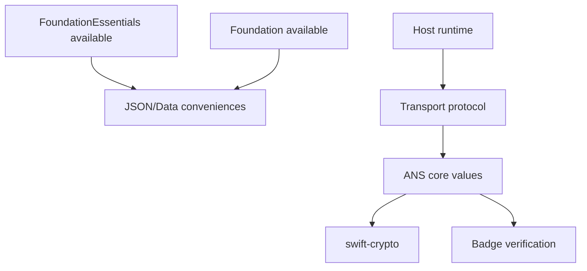

# ANS Swift SDK Philosophy

`ans-sdk-swift` is a Swift-native trust SDK for Agent Name Service. The module
name is the namespace, so public types use primitive names such as `Name`,
`Host`, `Verifier`, and `Client`.

## Principles

| Principle | Design consequence |
| --- | --- |
| The module is the namespace | Use `ANS.Name`; use `ANS::Name` only for collisions |
| Values first | Parse protocol evidence into validated value types early |
| Protocol boundaries | External systems are capabilities, not base classes |
| Effects are explicit | Network, DNS, storage, and certificate inspection live behind protocols |
| Portable by default | Core verification does not require URLSession, Dispatch, or platform stores |
| Fail closed | Ambiguous evidence returns typed rejection or absence outcomes |
| Preserve evidence | Fingerprints, wire statuses, and unknown values keep their exact meaning |

## Foundation Model

The `ANS` target is a single shared core. It uses standard-library values and
`Crypto` for portable hashing. When `FoundationEssentials` is available, the SDK
adds Data and JSON conveniences. When only `Foundation` is available, the same
conveniences are compiled against the Foundation surface. The core public model
does not make URLSession, FoundationNetworking, or platform certificate stores
mandatory.

## Operating Sentence

ANS for Swift should be small validated values, protocol-defined capabilities,
portable crypto primitives, and explicit trust outcomes.
