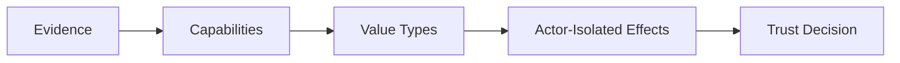

# ANS Swift SDK Philosophy

This document defines the design philosophy for `ans-sdk-swift`.
Concrete API and file layout requirements belong in `SPEC.md`.

## Purpose

`ans-sdk-swift` should make Agent Name Service usable from Swift without copying
the shape of the Go, Java, or Rust SDKs.

The SDK should feel like Swift 6.4: value-oriented, protocol-oriented,
concurrency-safe, and explicit about trust decisions.

## Principles

### The module is the namespace

The package product should be `ANS`. Public types should avoid redundant `ANS`
prefixes because users already access them through the module namespace.
The SDK should not define a wrapper namespace type such as `enum ANS`; the Swift
module itself is the namespace. Public documentation should use Swift module
selector syntax.

| Prefer | Avoid |
| --- | --- |
| `ANS::Name` | `ANSName` |
| `ANS::Version` | `ANSVersion` |
| `ANS::Client` | `ANSClient` |
| `ANS::Verifier` | `ANSVerifier` |

### Protocols define capabilities

Protocols should describe what a dependency can do, not what concrete
implementation it uses. Concrete adapters should be replaceable.

### Values carry protocol meaning

Security-relevant data should become validated values as early as possible:
names, versions, hosts, fingerprints, policies, badges, proofs, and outcomes.

### Effects are isolated

Networking, DNS, cache mutation, certificate loading, and transparency-log
verification are effects. They should be isolated behind async protocols and
actors where ordering or shared mutable state matters.

### Verification is a first-class workflow

Registration creates evidence. Discovery finds evidence. Verification decides
whether the running endpoint should be trusted.

### Fail closed by default

Ambiguous evidence should produce an explicit rejection unless the caller has
selected a clearly named relaxed policy.

### Preserve exact evidence

Signed payloads, SCITT receipts, status tokens, Merkle proofs, checkpoints, and
certificate DER bytes should remain available as exact bytes wherever
verification depends on exact representation.

### Specification drift is normal

ANS is evolving. The SDK should preserve unknown wire values while continuing
to enforce security-critical invariants.

### File names should be primitive

File names should name the primary type or capability directly. Prefixes that
repeat the package name are noise.

| Prefer | Avoid |
| --- | --- |
| `Name.swift` | `ANSName.swift` |
| `Client.swift` | `ANSClient.swift` |
| `Verifier.swift` | `ANSVerifier.swift` |
| `Registry.swift` | `ANSRegistryClient.swift` |

## Operating Sentence

`ans-sdk-swift` should be a Swift-native trust SDK: small validated values,
protocol-defined capabilities, actor-isolated effects, and explicit outcomes.
