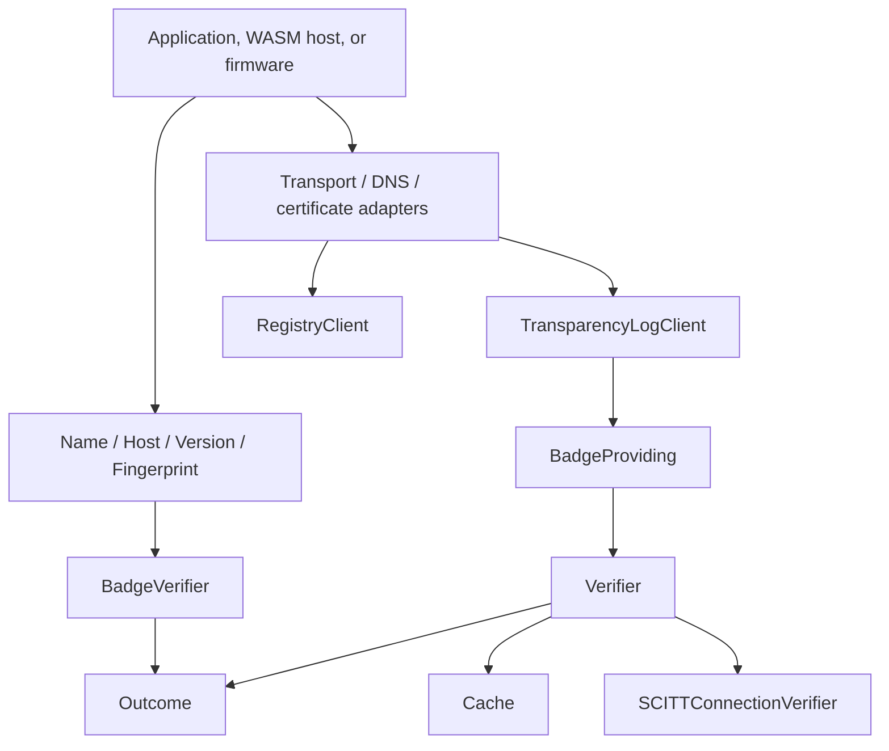
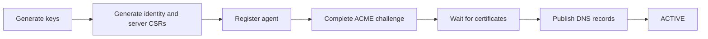

# ANS Swift SDK

Swift SDK for the Agent Name Service (ANS) ecosystem.

`ANS` is a single Swift library product that exposes validated protocol values,
registry and transparency-log clients, certificate/CSR utilities, badge
verification, DANE/TLSA helpers, SCITT verification, and agent-to-agent request
verification.

The normal Swift spelling is unqualified:

```swift
import ANS

let name = try Name(rawValue: "ans://v1.0.0.agent.example.com")
let host = try Host(rawValue: "agent.example.com")
```

Use the module namespace only when another module or local scope defines the
same name.

## API Specification Reference

The registry client follows the public ANS REST API:

- [View OpenAPI Spec - Human Readable](https://developer.godaddy.com/doc/endpoint/ans)
- [OpenAPI Spec - AI/Machine Readable](https://developer.godaddy.com/swagger/swagger_ans.json)

## Requirements

| Requirement | Value |
| --- | --- |
| Swift tools version | Swift 6.3 or newer |
| Product | `ANS` |
| Module | `ANS` |
| Test framework | Swift Testing |
| Crypto dependency | `swift-crypto` |

The package is designed for Apple platforms, WebAssembly, Embedded Swift, and
other Swift runtimes. The core does not require `URLSession`,
`FoundationNetworking`, `DispatchQueue`, or platform certificate stores.
Networking, DNS, and certificate extraction are supplied by the host runtime.

## Installation

Add the package to `Package.swift`:

```swift
dependencies: [
    .package(url: "https://github.com/1amageek/ans-sdk-swift.git", branch: "main"),
]
```

Add the product to a target:

```swift
.target(
    name: "MyAgent",
    dependencies: [
        .product(name: "ANS", package: "ans-sdk-swift"),
    ]
)
```

## Overview

ANS uses a dual-certificate trust model:

| Certificate | Issuer | Contains | Purpose |
| --- | --- | --- | --- |
| Server TLS certificate | Public CA or ANS server issuance | Agent host in DNS SAN | HTTPS server identity |
| Identity certificate | ANS Private CA | Agent host and `ans://v{version}.{host}` URI SAN | Agent identity for mTLS |

Verification can combine:

| Evidence | Swift surface | Purpose |
| --- | --- | --- |
| Badge | `Badge`, `BadgeVerifier`, `Verifier` | Confirms status and certificate fingerprints |
| DNS badge record | `BadgeDiscovery`, `DNSResolving` | Locates `_ans-badge` and `_ra-badge` evidence |
| Transparency log | `TransparencyLogClient` | Fetches badges, audits, checkpoints, receipts, and status tokens |
| DANE/TLSA | `TLSARecord`, `DANE`, `DANEPolicy` | Binds TLS certificates through DNSSEC-backed TLSA records |
| SCITT | `SCITTVerifier`, `SCITTConnectionVerifier`, `SCITTHeaders` | Offline-capable status-token and receipt verification |



## Package Shape

Swift intentionally keeps one shared product instead of language-specific
submodules. Runtime capabilities are introduced through protocols.

| Area | Public types |
| --- | --- |
| Core values | `Name`, `Host`, `Version`, `URI`, `Fingerprint`, `WireValue` |
| Registry | `Registry`, `RegistryClient`, `Registration`, `Agent`, `Certificate`, `CSR`, `Renewal`, `Identity` |
| Transparency log | `TransparencyLog`, `TransparencyLogClient`, `TransparencyRecord`, `Checkpoint`, `RootKey` |
| Verification | `Badge`, `BadgeVerifier`, `Verifier`, `Outcome`, `Policy`, `FailurePolicy` |
| DNS/DANE | `BadgeRecord`, `BadgeDiscovery`, `DNSResolving`, `TLSARecord`, `DANEPolicy` |
| SCITT | `SCITTHeaders`, `SCITTVerifier`, `SCITTConnectionVerifier`, `SCITTHeaderSupplier`, SCITT caches |
| Crypto | `KeyGenerator`, `KeyPair`, `CSRGenerator`, `CertificateSigningRequest` |
| Transport | `Transport`, `Request`, `Response`, `Client`, `AgentClient` |

## Quick Start

### Core Values

```swift
import ANS

let version = try Version("1.0.0")
let host = try Host(rawValue: "agent.example.com")
let name = Name(version: version, host: host)

print(name.rawValue)
print(host.ansBadgeName)
print(host.tlsaName(port: 443))
```

### Registry Authority Client

The SDK owns request/response modeling, validation, authentication headers, and
path construction. The host supplies a `Transport` implementation.

```swift
import ANS

let transport: any Transport = MyTransport()

let client = Client(
    configuration: Configuration(
        registryBaseURI: try URI(rawValue: "https://api.godaddy.com"),
        authorization: .apiKey(id: apiKey, secret: apiSecret)
    ),
    transport: transport
)

let registry = RegistryClient(client: client)

let host = try Host(rawValue: "agent.example.com")
let version = try Version("1.0.0")
let name = Name(version: version, host: host)

let keyGenerator = KeyGenerator()
let csrGenerator = CSRGenerator()
let identityKey = keyGenerator.p256()
let serverKey = keyGenerator.p256()

let identityCSR = try csrGenerator.identityCSR(name: name, keyPair: identityKey)
let serverCSR = try csrGenerator.serverCSR(host: host, keyPair: serverKey)

let endpoint = Endpoint(
    url: try URI(rawValue: "https://agent.example.com/mcp"),
    protocolKind: .mcp,
    transports: [.streamableHTTP],
    metadataURL: try URI(rawValue: "https://agent.example.com/.well-known/agent-card.json"),
    functions: [
        Function(id: "search", name: "Search", tags: ["retrieval"]),
    ]
)

let request = try Registration.Request(
    displayName: "My Agent",
    host: host,
    endpoints: [endpoint],
    version: version,
    identityCSRPEM: identityCSR.pem,
    serverCSRPEM: serverCSR.pem,
    description: "An ANS-registered agent"
)

let pending = try await registry.registerAgent(request)
print(pending.agent.id)
print(pending.status as Any)
print(pending.challenges)
print(pending.dnsRecords)
```

Registration follows the same high-level flow used by the Go, Rust, and Java
SDKs:



### Agent Resolution

```swift
let result = try await registry.resolve(
    host: try Host(rawValue: "agent.example.com"),
    version: try VersionRequirement("^1.0.0")
)

if let result {
    print(result.agent.displayName)
    print(result.endpoint as Any)
}
```

### Transparency Log Client

```swift
let client = Client(
    configuration: Configuration(
        registryBaseURI: try URI(rawValue: "https://api.godaddy.com"),
        transparencyLogBaseURI: try URI(rawValue: "https://transparency.ans.godaddy.com")
    ),
    transport: transport
)

let transparencyLog = TransparencyLogClient(client: client)
let badge = try await transparencyLog.badge(for: Agent.ID(rawValue: "agent-id"))
let checkpoint = try await transparencyLog.checkpoint()
let rootKeys = try await transparencyLog.rootKeys()

print(badge.status)
print(checkpoint)
print(rootKeys.count)
```

## Verification

### Local Badge Verification

Use `BadgeVerifier` when evidence is already available.

```swift
let host = try Host(rawValue: "agent.example.com")
let fingerprint = try Fingerprint.sha256(bytes: certificateDER)
let badge = Badge(host: host, status: .active, serverFingerprint: fingerprint)

let outcome = BadgeVerifier().verifyServer(
    host: host,
    fingerprint: fingerprint,
    badge: badge
)

guard outcome == .verified else {
    throw VerificationFailed(outcome: outcome)
}
```

### Async Badge Verification

Use `Verifier` when badge evidence comes from DNS, a transparency log, or a
custom provider.

```swift
struct MyBadgeProvider: BadgeProviding {
    func badge(for host: Host) async throws(any Error) -> Badge? {
        try await fetchBadge(for: host)
    }
}

let verifier = Verifier(
    provider: MyBadgeProvider(),
    cache: Cache(),
    failurePolicy: .failOpenWithCache(maximumStaleness: .seconds(600)),
    danePolicy: .validateIfPresent
)

let certificate = try CertificateIdentity(derBytes: serverCertificateDER)
let outcome = try await verifier.verifyServer(
    host: try Host(rawValue: "agent.example.com"),
    certificate: certificate
)

switch outcome {
case .verified:
    print("verified")
case .degraded(let reason):
    print("degraded: \(reason)")
case .notANSAgent:
    print("not an ANS agent")
case .rejected(let reason):
    print("rejected: \(reason)")
}
```

### Agent-to-Agent Client

`AgentClient` verifies the peer certificate after the host `Transport` returns
the response and peer certificate bytes.

```swift
let agentClient = AgentClient(
    transport: transport,
    verifier: verifier,
    verifyServer: true,
    scittPolicy: .withBadgeFallback
)

let uri = try URI(rawValue: "https://target-agent.example.com/api/status")
let response = try await agentClient.get(uri)

print(response.response.statusCode)
print(response.outcome as Any)
```

## SCITT Verification

SCITT adds signed, cacheable trust artifacts to badge verification.

| Artifact | Header/API | Purpose |
| --- | --- | --- |
| Status token | `X-ANS-Status-Token` | Signed current status and certificate fingerprints |
| Receipt | `X-SCITT-Receipt` | Optional Merkle inclusion proof |
| Root keys | `TransparencyLogClient.rootKeys()` | Verification keys for status tokens and receipts |

SCITT policy modes:

| Policy | Behavior |
| --- | --- |
| `SCITTPolicy.withBadgeFallback` | Verify SCITT when headers exist, otherwise use badge verification |
| `SCITTPolicy.requireSCITT` | Require SCITT headers and reject missing headers |
| `SCITTPolicy.badgeWithSCITTEnhancement` | Verify badge first and upgrade with SCITT when present |

Agents can use `SCITTHeaderSupplier` to fetch, verify, cache, and publish their
own outgoing SCITT headers:

```swift
let supplier = SCITTHeaderSupplier(
    agentID: Agent.ID(rawValue: "agent-id"),
    artifacts: transparencyLog,
    verifier: scittVerifier
)

let headers = await supplier.currentHeaders().httpHeaders()
```

## Runtime Support

The same `ANS` target is used across runtimes. Availability is intentionally
capability-based.

| API surface | Apple platforms | WASM | Embedded Swift |
| --- | --- | --- | --- |
| Core values | Available | Available | Available |
| `Fingerprint.sha256(bytes:)` | Available | Available | Available |
| `BadgeVerifier` | Available | Available | Available |
| `Cache` | Available with `Mutex` | Available with `Mutex` | Available with injected monotonic time |
| Codable / JSON helpers | Available | Available when Foundation surface exists | Not available |
| Async transport clients | Available | Available | Not available |
| Registry / Transparency clients | Available | Available | Not available |
| SCITT async verification helpers | Available | Available | Not available |

## Features

### Registry Authority

| Capability | Swift API |
| --- | --- |
| Agent registration | `RegistryClient.register`, `registerAgent` |
| ACME and DNS validation | `verifyACME`, `verifyDNS`, `validateRegistration`, `verifyDNSRecords` |
| Agent details and listing | `agent`, `agentDetails`, `listAgents` |
| Search and resolution | `search`, `resolve` |
| Revocation | `revoke`, `revokeAgent` |
| Certificates and CSRs | `certificates`, `submitCSR`, `csrStatus`, v2 agent certificate APIs |
| Server certificate renewal | `submitServerCertificateRenewal`, `serverCertificateRenewalStatus`, `cancelServerCertificateRenewal`, `verifyRenewalACME` |
| Verified Identity | `registerIdentity`, `listIdentities`, `identity`, `rotateIdentity`, `verifyIdentityControl`, `revokeIdentity`, `linkIdentity`, `unlinkIdentity` |
| Events | `events` |

### Transparency Log

| Capability | Swift API |
| --- | --- |
| Agent badge | `badge(for:)`, `badge(at:)` |
| Agent audit | `audit(agentID:page:)` |
| Checkpoints and schema | `checkpoint`, `checkpointHistory`, `schema` |
| SCITT artifacts | `receipt`, `statusToken`, `rootKeys` |
| Identity records | `identityBadge`, `identityAudit`, `identityReceipt` |
| Identity joins | `identityAgents`, `agentIdentities`, `agentIdentityHistory` |
| C2SP data | `rawCheckpoint`, `tile`, `partialTile`, `entryTile`, `partialEntryTile` |

### Verification

| Capability | Swift API |
| --- | --- |
| Server badge verification | `BadgeVerifier.verifyServer`, `Verifier.verifyServer` |
| Client mTLS badge verification | `BadgeVerifier.verifyClient`, `Verifier.verifyClient` |
| Failure policies | `FailurePolicy.failClosed`, `failOpen`, `failOpenWithCache` |
| DANE/TLSA | `DANE.verify`, `DANEPolicy` |
| Badge cache | `Cache`, `Caching` |
| Agent requests | `AgentClient` |

### Crypto

| Capability | Swift API |
| --- | --- |
| EC key generation | `KeyGenerator.p256`, `p384`, `p521` |
| Server CSR | `CSRGenerator.serverCSR(host:keyPair:)` |
| Identity CSR | `CSRGenerator.identityCSR(name:keyPair:)` |
| PEM output | `KeyPair` and `CertificateSigningRequest` PEM views |

## Configuration

### Environments

| Environment | Registry Authority | Transparency Log |
| --- | --- | --- |
| Production | `https://api.godaddy.com` | `https://transparency.ans.godaddy.com` |
| OTE | `https://api.ote-godaddy.com` | `https://transparency.ans.ote-godaddy.com` |

### Authentication

```swift
Configuration(
    registryBaseURI: try URI(rawValue: "https://api.godaddy.com"),
    authorization: .bearer(token)
)

Configuration(
    registryBaseURI: try URI(rawValue: "https://api.godaddy.com"),
    authorization: .jwt(jwt)
)

Configuration(
    registryBaseURI: try URI(rawValue: "https://api.godaddy.com"),
    authorization: .apiKey(id: apiKey, secret: apiSecret)
)
```

### Cache

`Cache.Configuration.defaults` aligns with the Go and Rust verifier behavior:

| Setting | Default |
| --- | --- |
| `maxEntries` | `1000` |
| `defaultTTL` | `300` seconds |
| `refreshThreshold` | `60` seconds |
| `staleRetention` | `600` seconds |

```swift
let cache = Cache(configuration: try Cache.Configuration(
    maxEntries: 1000,
    defaultTTL: .seconds(300),
    refreshThreshold: .seconds(60),
    staleRetention: .seconds(600)
))
```

## Error Handling

Parsing and validation errors are typed:

| Error type | Scope |
| --- | --- |
| `ParsingError` | Invalid `Name`, `Host`, `Version`, `URI`, fingerprint, or certificate-derived values |
| `ValidationError` | Invalid request shape or missing required configuration |
| `HTTPError` | Non-2xx registry or transparency-log response |
| `CertificateError` | DER certificate parsing failure |
| `CryptoError` | Key, DER, PEM, CSR, or signature operation failure |
| `SCITTError` | SCITT token, receipt, root-key, or header failure |
| `AgentClientError` | Agent request verification or response failure |

Verification failures are represented as `Outcome` values whenever possible, so
callers can distinguish absence, degradation, and rejection.

## Building and Testing

Run the Swift Testing suite with Xcode:

```bash
xcodebuild test -scheme ans-sdk-swift -destination platform=macOS
```

Build for WebAssembly:

```bash
swiftly run swift build --swift-sdk swift-6.3.1-RELEASE_wasm
```

Build for Embedded Swift WebAssembly:

```bash
swiftly run swift build --swift-sdk swift-6.3.1-RELEASE_wasm-embedded
```

## Design Notes

- `ANS` is the library namespace; there is no wrapper `ANS` type.
- Public names are primitive Swift names such as `Name`, `Host`, `Cache`,
  `Client`, and `Verifier`.
- External effects are protocol boundaries: `Transport`, `DNSResolving`,
  `BadgeProviding`, `Registry`, and `TransparencyLog`.
- `Cache` and SCITT caches use `Mutex` for short synchronous critical sections.
- `Verifier` and `SCITTHeaderSupplier` are actors because they cross async I/O
  boundaries.
- Concrete networking is intentionally outside the core package so hosts can
  provide URLSession, FoundationNetworking, embedded, WASI, or custom adapters.
