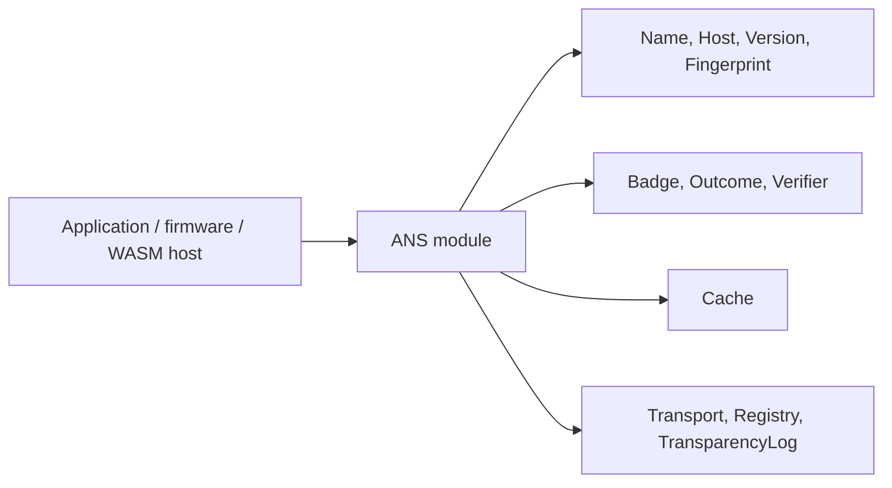
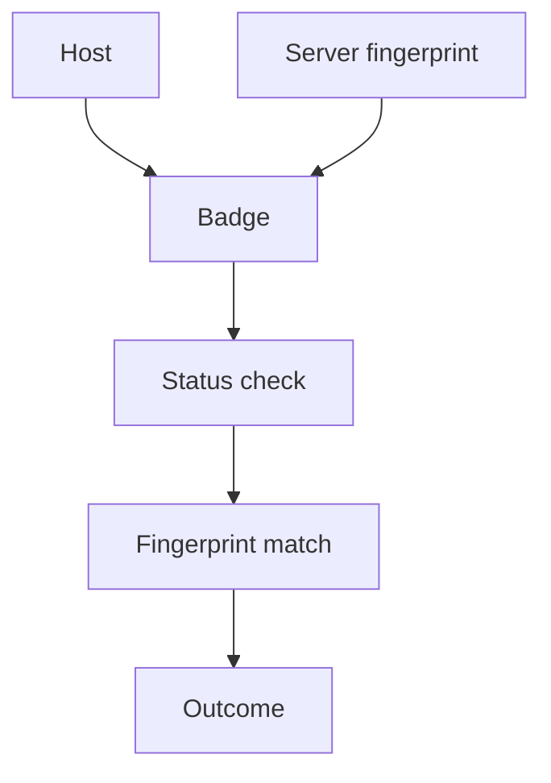
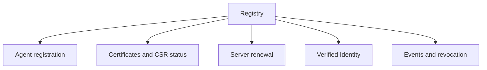
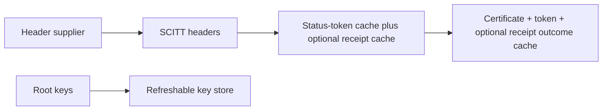

# ANS Swift SDK Specification

This package exposes one library product, `ANS`.

| Item | Requirement |
| --- | --- |
| Swift tools version | 6.3 or newer |
| Product | `ANS` |
| Module | `ANS` |
| Namespace style | Module namespace, no wrapper `ANS` type |
| Core dependency | `swift-crypto` |
| Test framework | Swift Testing |
| File naming | Primitive names without redundant package prefixes |

## Runtime Shape

The core must compile for Apple platforms, WebAssembly, and Embedded-oriented
Swift SDKs. The core must not require URLSession, FoundationNetworking,
DispatchQueue, or platform certificate stores.

## Foundation Compatibility

| Environment | Behavior |
| --- | --- |
| `FoundationEssentials` available | Compile Data and JSON convenience APIs |
| `Foundation` available | Compile the same convenience APIs against Foundation |
| Neither available | Core values, hashing, and synchronous verification still compile |

Embedded Swift does not expose `Codable`, `Encoder`, or `Decoder`. For that
reason JSON conveniences and Codable conformances are compiled only outside
Embedded. Embedded keeps the same validated values and synchronous local badge
verification path.

| API surface | Apple / WASM | Embedded |
| --- | --- | --- |
| Values | available | available |
| `Fingerprint.sha256(bytes:)` | available | available |
| `Fingerprint.sha256(der:)` | available when Data exists | available when Data exists |
| Codable conformances | available | unavailable |
| JSON helper | available | unavailable |
| Async transport/client protocols | available | unavailable |
| `BadgeVerifier` | available | available |
| `Cache` | available with `Mutex` | available with injected monotonic time |
| `Caching` protocol | available | unavailable |

## Core Types

| Type | Responsibility |
| --- | --- |
| `Version` | Numeric `major.minor.patch` version |
| `Host` | Strict FQDN validation |
| `Name` | `ans://v{major}.{minor}.{patch}.{host}` identifier |
| `URI` | Portable URI authority parser for endpoint and transport values |
| `Fingerprint` | Canonical certificate fingerprint, currently `SHA256:<hex>` |
| `WireValue` | Unknown-preserving protocol string value |
| `Badge` | Current ANS evidence for a host |
| `Outcome` | Typed verification result |
| `Cache` | TTL and stale-retention cache for badge evidence |
| `FailurePolicy` | Infrastructure-failure behavior for async verification |

## Verification

`BadgeVerifier` performs synchronous local verification from already supplied
evidence. `Verifier` is an actor because it crosses an async evidence-provider
boundary.

`Verifier` checks fresh cached badges before calling `BadgeProviding`. A
fingerprint mismatch in cache does not reject immediately; it triggers a fresh
provider lookup so certificate rotation can recover. If the provider throws,
`FailurePolicy.failOpenWithCache` may accept a stale cached badge only after the
badge is re-verified against the requested host and fingerprint.

`Cache` stores entries by host and by host-version. Defaults align with the Go
and Rust SDKs: 1000 entries, 5 minute TTL, 1 minute refresh threshold, and 10
minute stale retention. On Apple platforms and WASM it uses `Mutex` because the
critical section is short and contains no suspension. On Embedded Swift,
`Mutex` and `ContinuousClock` are not available, so `Cache` exposes the same
operations with host-supplied monotonic nanoseconds for TTL behavior.

## Protocol Boundaries

| Protocol | Capability |
| --- | --- |
| `BadgeProviding` | Fetch current badge evidence for a host |
| `Caching` | Cache abstraction for non-Embedded verifier injection |
| `Transport` | Send runtime-provided HTTP-like requests |
| `Registry` | Registry workflow boundary |
| `TransparencyLog` | Transparency-log evidence boundary |

Concrete network, DNS, certificate, and storage adapters can be added without
changing domain values.

## Cross-Language Feature Inventory

The Swift surface is derived from the public Go, Rust, Java, registry, and
transparency-log implementations. Package-manager repositories are not protocol
SDKs and are intentionally excluded.

| Feature group | Go | Rust | Java | Registry/TL spec | Swift surface |
| --- | --- | --- | --- | --- | --- |
| Core ANS values (`Name`, `Host`, `Version`, fingerprint) | yes | yes | yes | yes | `Name`, `Host`, `Version`, `Fingerprint` |
| Endpoint/function/registration models | yes | yes | yes | yes | `Endpoint`, `Function`, `Registration` |
| Legacy registry workflow | yes | yes | yes | v1 | `Registry` / `RegistryClient` |
| v2 agent management | spec | spec | spec | `/ans/agents` | `registerAgent`, `listAgents`, `agentDetails`, v2 validation, v2 revoke |
| Certificate retrieval and CSR status | yes | yes | yes | v1/v2 | `Certificate`, `CSR`, `submitCSR`, `csrStatus` |
| Server certificate renewal | spec | spec | spec | v2 | `Renewal`, `submitServerCertificateRenewal`, status, cancel, verify ACME |
| Verified Identity management | spec | spec | spec | v2 optional | `Identity.ChallengeRound`, `Identity.Details`, register/list/rotate/verify/revoke/link/unlink |
| Registry event stream | yes | yes | yes | v1 | `Event`, `EventPage` |
| DNS badge discovery | yes | yes | yes | ANS-3 | `BadgeRecord`, `BadgeDiscovery`, `DNSResolving` |
| RA badge and trusted RA URL validation | yes | yes | yes | ANS-3 | `BadgeURLValidator`, `_ra-badge` source |
| DANE/TLSA | yes | yes | yes | ANS-3 | `TLSARecord`, `DANE`, `DANEPolicy` |
| Certificate identity extraction | yes | yes | yes | ANS-2 | `CertificateIdentity` |
| Badge cache with stale retention | yes | yes | yes | verifier behavior | `Cache`, `Caching` |
| Server/client badge verification | yes | yes | yes | ANS-2/3/5 | `BadgeVerifier`, `Verifier` |
| SCITT headers | yes | yes | yes | TL v2 | `SCITTHeaders` |
| SCITT COSE/CBOR receipt verification | yes | yes | yes | TL v2 | `COSESign1`, `CBOR`, `SCITTVerifier` |
| SCITT status-token verification | yes | yes | yes | TL v2 | `StatusTokenPayload`, `VerifiedStatusToken` |
| SCITT root-key store | yes | yes | yes | `/root-keys` | `RootKey`, `SCITTKeyStore` |
| SCITT verification policy modes | yes | yes | yes | verifier behavior | `SCITTPolicy` |
| SCITT artifact/key caches | yes | yes | yes | verifier behavior | `SCITTReceiptCache`, `SCITTStatusTokenCache`, `SCITTVerificationCache`, `SCITTRefreshableKeyStore` |
| Agent-side outgoing SCITT headers | yes | yes | yes | verifier behavior | `SCITTHeaderSupplier`, `SCITTOutgoingHeaders` |
| Agent HTTP client with post-response verification | yes | partial | yes | verifier behavior | `AgentClient` |
| Transparency badge/audit/checkpoint/schema | yes | yes | yes | `/v1/agents`, `/v1/log` | `TransparencyLogClient` |
| Transparency receipts/status/root keys | yes | yes | yes | `/receipt`, `/status-token`, `/root-keys` | `receipt`, `statusToken`, `rootKeys` |
| Transparency identity reads | spec | spec | spec | `/v1/identities` | `identityBadge`, `identityAudit`, `identityReceipt`, joins |
| C2SP checkpoint and tiles | spec | spec | spec | `/checkpoint`, `/tile/*` | `rawCheckpoint`, `tile`, `entryTile` |
| EC key generation | yes | examples/tests | yes | registration support | `KeyGenerator.p256/p384/p521` |
| Server and identity CSR generation | submit only | submit only | yes | registration support | `CSRGenerator.serverCSR`, `identityCSR` |

## Registry Surface

`Registry` is the authenticated management boundary. It covers both the current
v1 Go/Rust client surface and the v2 optional management surfaces defined in
the registry OpenAPI contract.

| Operation family | Swift API |
| --- | --- |
| Register and validate agent | `register`, `challengeDetails`, `verifyACME`, `verifyDNS` |
| v2 agent management | `registerAgent`, `listAgents`, `agentDetails`, `validateRegistration`, `verifyDNSRecords`, `revokeAgent` |
| Discover registered agents | `agent`, `search`, `resolve` |
| Certificates | `certificates`, `submitCSR`, `csrStatus`, `agentCertificates`, `submitAgentCSR`, `agentCSRStatus` |
| Server renewal | `submitServerCertificateRenewal`, `serverCertificateRenewalStatus`, `cancelServerCertificateRenewal`, `verifyRenewalACME` |
| Verified Identity | `registerIdentity`, `listIdentities`, `identity`, `rotateIdentity`, `verifyIdentityControl`, `revokeIdentity`, `linkIdentity`, `unlinkIdentity` |
| Lifecycle | `events`, `revoke` |

`URI.appending(path:)` preserves a base path. This is required because v2
registry deployments use a base URI such as `https://host/v2` with paths under
`/ans/...`.

## Transparency Log Surface

`TransparencyLog` exposes verifier reads only. It does not include producer or
admin ingest routes.

| Operation family | Swift API |
| --- | --- |
| Agent badge and audit | `badge(for:)`, `audit` |
| Agent SCITT artifacts | `receipt`, `statusToken` |
| Log metadata | `checkpoint`, `checkpointHistory`, `schema` |
| C2SP artifacts | `rawCheckpoint`, `rootKeys`, `tile`, `partialTile`, `entryTile`, `partialEntryTile` |
| Identity public reads | `identityBadge`, `identityAudit`, `identityReceipt` |
| Identity computed joins | `identityAgents`, `agentIdentities`, `agentIdentityHistory` |

Identity badge and audit reads use `TransparencyRecord` rather than `Badge`
because identity events are not guaranteed to carry agent host and certificate
fields.

## Crypto Surface

The crypto surface is intentionally small and registration-focused. It has no
file I/O requirement and can be used by WASM hosts and embedded firmware that
provide entropy through Swift Crypto.

| Type | Responsibility |
| --- | --- |
| `KeyGenerating` | Abstract key-generation boundary |
| `KeyGenerator` | Default EC signing key generator |
| `KeyPair` | P-256, P-384, or P-521 signing key pair with DER/PEM views |
| `CSRGenerating` | Abstract CSR-generation boundary |
| `CSRGenerator` | PKCS#10 server and identity CSR generation |
| `CertificateSigningRequest` | DER plus PEM representation |

Server CSRs include CN and DNS SAN for the agent host. Identity CSRs include CN,
DNS SAN, and URI SAN carrying the `ans://v{version}.{host}` name.

RSA key generation exists in the Go and Java utilities for legacy
interoperability. The common Swift core exposes EC signing keys because they are
the cross-runtime path needed for ANS CSRs and SCITT verification. A platform
adapter can add RSA without changing `Registry` or `CSRGenerating`.

## SCITT Operational Surface

SCITT verification has two cache layers:

| Surface | Responsibility |
| --- | --- |
| `SCITTReceiptCache` | Agent-keyed verified receipt cache with fixed TTL |
| `SCITTStatusTokenCache` | Agent-keyed verified status-token cache using token `exp` |
| `SCITTVerificationCache` | Verifier-side content and outcome cache |
| `SCITTRefreshableKeyStore` | Static or refreshable root-key lookup with cooldown-gated refresh |
| `SCITTHeaderSupplier` | Fetch, verify, cache, and expose an agent's own outgoing SCITT headers |
| `SCITTPolicy` | Select fallback, required-SCITT, or badge-first enhancement verification |

`X-ANS-Status-Token` is the minimum SCITT proof for a connection.
`X-SCITT-Receipt` is optional and upgrades the proof when present, but receipt
absence must not invalidate an otherwise valid status token.

SCITT caches use `Mutex` because they are short in-memory critical sections
with no suspension. `SCITTHeaderSupplier` uses an actor because it fetches
artifacts and verifies them asynchronously.
