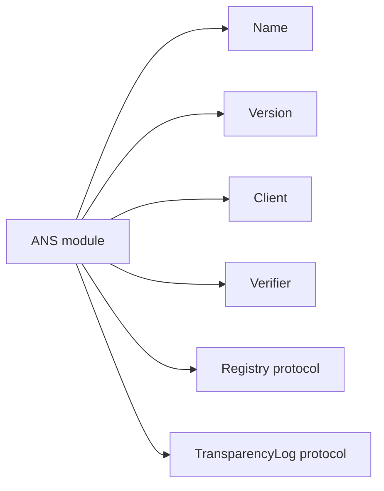
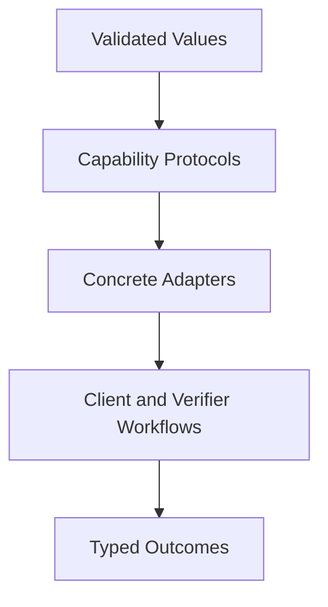
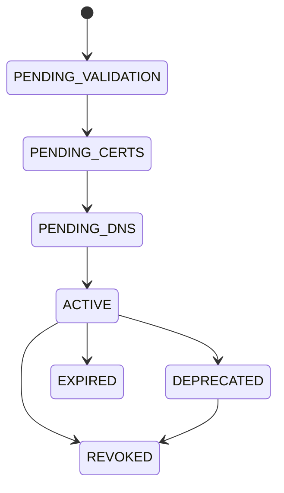
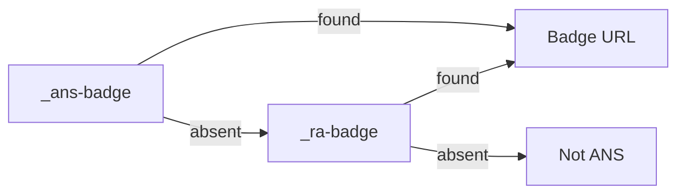
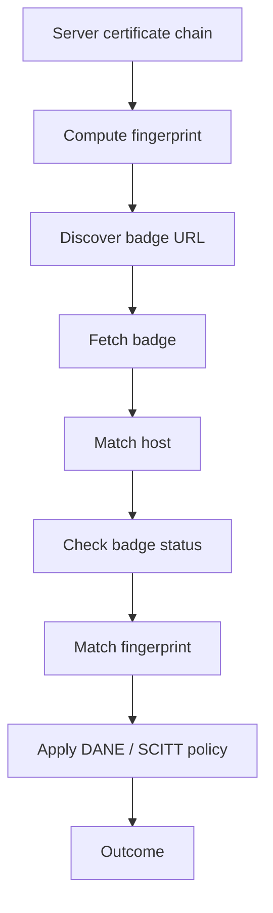
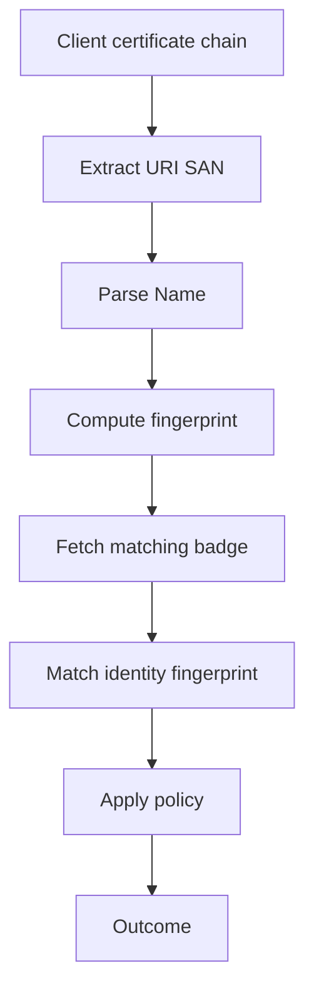
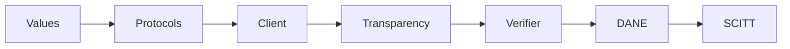

# ANS Swift SDK Specification

This document defines the Swift 6.4 design specification for `ans-sdk-swift`.
It uses the ANS protocol and existing SDKs as source material, but the Swift API
is designed independently around Swift language conventions.

## 1. Design Target

| Item | Requirement |
| --- | --- |
| Swift version | Swift 6.4 |
| SwiftPM tools version | `// swift-tools-version: 6.4` |
| Primary product | `ANS` |
| Primary module | `ANS` |
| Public style | Protocol-oriented, value-oriented, concurrency-safe |
| Naming style | Primitive file names and module-scoped public types |

The module name is the prefix. Public symbols should not repeat `ANS`.
The package MUST NOT introduce a wrapper namespace type named `ANS`; callers use
the Swift module selector directly.



## 2. Package Layout

The package exposes the full `ANS` target and a constrained `ANSEmbedded`
target. Subdomains are represented by folders and protocols, not by prefix-heavy
module names.

```text
Package.swift
Sources/
  ANS/
    Cache/
    Core/
    Discovery/
    Network/
    Registry/
    Transparency/
    Verification/
  ANSEmbedded/
    Badge.swift
    BadgeProviding.swift
    Endpoint.swift
    Fingerprint.swift
    Host.swift
    Name.swift
    Outcome.swift
    ParsingError.swift
    VerificationError.swift
    Verifier.swift
    Version.swift
Tests/
  ANSTests/
    Core/
    Network/
    Support/
    Transparency/
    Verification/
  ANSEmbeddedTests/
    EmbeddedTests.swift
```

File naming rules:

| Rule | Requirement |
| --- | --- |
| Package prefix | File names MUST NOT start with `ANS` unless the file is package metadata |
| One primary type | Each file SHOULD contain one primary public type or capability |
| Primitive names | Use `Name.swift`, `Client.swift`, `Verifier.swift`, not `ANSName.swift` |
| Directories | Folders MAY group concerns, but file names remain primitive |

## 3. SwiftPM Manifest

The initial manifest shape:

```swift
// swift-tools-version: 6.4

import PackageDescription

let package = Package(
    name: "ans-sdk-swift",
    platforms: [
        .macOS(.v15),
        .iOS(.v18),
        .tvOS(.v18),
        .watchOS(.v11),
        .visionOS(.v2),
    ],
    products: [
        .library(name: "ANS", targets: ["ANS"]),
        .library(name: "ANSEmbedded", targets: ["ANSEmbedded"]),
    ],
    targets: [
        .target(name: "ANS"),
        .target(name: "ANSEmbedded"),
        .testTarget(name: "ANSTests", dependencies: ["ANS"]),
        .testTarget(name: "ANSEmbeddedTests", dependencies: ["ANSEmbedded"]),
    ]
)
```

Core value types SHOULD avoid Apple-only APIs when practical. The full `ANS`
target may use Foundation, URLSession, JSONEncoder, and CryptoKit. The
`ANSEmbedded` target MUST remain Foundation-free.

## 4. Public Usage Shape

The official public usage shape is unqualified names after importing the module.

```swift
import ANS

let name = try Name(rawValue: "ans://v1.0.0.agent.example.com")
let host = try Host(rawValue: "agent.example.com")
let client = Client(configuration: configuration, transport: transport)
let verifier = Verifier(
    resolver: resolver,
    log: log,
    inspector: inspector,
    cache: cache
)
```

Swift module selector syntax is reserved for collision cases.

```swift
let ansName = try ANS::Name(rawValue: rawValue)
```

Naming requirements:

| Concept | Public symbol | Collision-qualified use |
| --- | --- | --- |
| Versioned ANS identifier | `Name` | `ANS::Name` |
| Numeric version | `Version` | `ANS::Version` |
| FQDN host | `Host` | `ANS::Host` |
| Default API client | `Client` | `ANS::Client` |
| Default verifier | `Verifier` | `ANS::Verifier` |
| Registry capability | `Registry` | `ANS::Registry` |
| Transparency capability | `TransparencyLog` | `ANS::TransparencyLog` |

The SDK MUST NOT expose redundant public names such as `ANSName`, `ANSClient`,
or `ANSVerifier`.

## 4.1 Embedded Usage Shape

Robots and constrained runtimes use the `ANSEmbedded` target when Foundation,
URLSession, JSON, or CryptoKit are unavailable or undesirable.

```swift
import ANSEmbedded

let host = try Host(rawValue: "robot.example.com")
let fingerprint = try Fingerprint(rawValue: "SHA256:<hex>")
let verifier = Verifier(provider: badgeProvider)
let outcome = try verifier.verifyServer(host: host, fingerprint: fingerprint)
```

Embedded responsibilities:

| Layer | Requirement |
| --- | --- |
| Name parsing | `Name`, `Version`, and `Host` are available without Foundation |
| Badge verification | compare host, badge status, and supplied fingerprint |
| Transport | provided by host firmware or application code |
| Cryptography | provided by host firmware or application code |
| JSON / CBOR | provided outside the embedded core |

The embedded target MUST prefer generic static dispatch over existential-heavy
runtime composition.

## 5. Architectural Shape

The SDK is built from values, protocols, and effect adapters.



| Layer | Swift construct | Examples |
| --- | --- | --- |
| Domain values | `struct`, `enum` | `Name`, `Version`, `Host`, `Fingerprint`, `Badge` |
| Capabilities | `protocol` | `Registry`, `TransparencyLog`, `Transport`, `Resolving` |
| Effectful implementations | `actor` or `struct` | `Client`, `Verifier`, `NetworkTransport` |
| Error surface | typed `Error` enums | `ParsingError`, `VerificationError` |

Inheritance MUST NOT be used for SDK extension points. Extension points are
protocols.

## 6. Protocol-Oriented Rules

Protocols define capability boundaries:

| Protocol | Capability |
| --- | --- |
| `Registry` | Register, resolve, revoke, fetch certificates, verify ACME and DNS |
| `TransparencyLog` | Fetch badge, audit, checkpoint, root keys, receipts, status tokens |
| `Transport` | Send HTTP requests |
| `Resolving` | Resolve DNS TXT, TLSA, SVCB, and HTTPS records |
| `CertificateInspecting` | Extract SANs, URI SANs, fingerprints, and chains |
| `Signing` | Sign challenge payloads or CSRs where needed |
| `KeyGenerating` | Generate key material |
| `Caching` | Store verification artifacts with expiry |

Protocol naming rules:

| Prefer | Avoid |
| --- | --- |
| `Registry` | `RegistryClientProtocol` |
| `TransparencyLog` | `TransparencyLogClientProtocol` |
| `Transport` | `HTTPTransportProtocol` |
| `Resolving` | `DNSResolverProtocol` |

Concrete adapters MAY carry descriptive names:

| Adapter | Role |
| --- | --- |
| `Client` | Default Registry and Transparency client |
| `NetworkTransport` | URLSession-backed transport |
| `Verifier` | Default verification workflow |
| `MemoryCache` | In-memory cache |

## 7. Concurrency Rules

All public effectful operations MUST use `async throws`.

| Concern | Required construct |
| --- | --- |
| HTTP calls | `async throws` |
| DNS lookups | `async throws` |
| Certificate loading | `async throws` when I/O is involved |
| Cache with I/O or ordering | `actor` |
| Short in-memory-only mutation | lock only when no suspension point exists |

All public values SHOULD conform to `Sendable` when possible. Public closures
crossing concurrency boundaries MUST be `@Sendable`.

The SDK MUST NOT use `@unchecked Sendable` as a shortcut. If a dependency is not
sendable, isolate it behind an actor.

Public types that expose `AsyncStream` or `AsyncThrowingStream` MUST provide an
explicit `shutdown()` path when the stream can outlive the caller.

## 8. Core Types

### 8.1 `Name`

`Name` is the versioned ANS identifier.

```text
ans://v{major}.{minor}.{patch}.{host}
```

Requirements:

| Field | Rule |
| --- | --- |
| Scheme | `ans` |
| Version prefix | `v` |
| Version | numeric `major.minor.patch` |
| Host | strict `Host` |
| Prerelease | rejected |
| Build metadata | rejected |

Swift shape:

```swift
public struct Name: Sendable, Hashable, Codable, RawRepresentable {
    public let rawValue: String
    public let version: Version
    public let host: Host

    public init(rawValue: String) throws
}
```

### 8.2 `Version`

`Version` is a numeric semantic version without prerelease or build metadata.

```swift
public struct Version: Sendable, Hashable, Codable, Comparable {
    public let major: Int
    public let minor: Int
    public let patch: Int

    public init(major: Int, minor: Int, patch: Int) throws
    public init(_ rawValue: String) throws
}
```

### 8.3 `Host`

`Host` is a strict FQDN used as the operational endpoint authority.

Validation:

| Rule | Requirement |
| --- | --- |
| Labels | LDH characters |
| Label length | 1 to 63 octets |
| Hyphen | Not first or last character of a label |
| IP literal | rejected |
| Single-label host | rejected in production initializer |

Swift shape:

```swift
public struct Host: Sendable, Hashable, Codable, RawRepresentable {
    public let rawValue: String

    public init(rawValue: String) throws
}
```

Testing-only local hosts MAY be supported through an explicitly named test
factory in test support, not through the production initializer.

### 8.4 `Agent`

`Agent` represents a registry view of an agent.

```swift
public struct Agent: Sendable, Hashable, Codable, Identifiable {
    public struct ID: Sendable, Hashable, Codable, RawRepresentable {
        public let rawValue: String
    }

    public let id: ID
    public let entryID: Entry.ID?
    public let name: Name?
    public let host: Host
    public let displayName: String
    public let description: String?
    public let version: Version?
    public let status: Registration.Status
    public let endpoints: [Endpoint]
}
```

### 8.5 `Entry`

`Entry` represents a Transparency Log identity.

```swift
public struct Entry: Sendable, Hashable, Codable {
    public struct ID: Sendable, Hashable, Codable, RawRepresentable {
        public let rawValue: String
    }
}
```

### 8.6 `Identity`

`Identity` represents the optional verified identity surface.

```swift
public struct Identity: Sendable, Hashable, Codable, Identifiable {
    public struct ID: Sendable, Hashable, Codable, RawRepresentable {
        public let rawValue: String
    }

    public let id: ID
    public let status: Status
}
```

### 8.7 `Fingerprint`

`Fingerprint` represents a certificate hash.

```swift
public struct Fingerprint: Sendable, Hashable, Codable, RawRepresentable {
    public let rawValue: String

    public static func sha256(der: Data) -> Fingerprint
}
```

The canonical display form SHOULD be `SHA256:<hex>`.

## 9. Resilient Wire Values

Protocol enum-like values MUST preserve unknown cases.

Preferred shape:

```swift
public struct WireValue: Sendable, Hashable, Codable, RawRepresentable {
    public let rawValue: String
}
```

Domain-specific wrappers MAY expose known constants:

```swift
public struct TransportKind: Sendable, Hashable, Codable, RawRepresentable {
    public let rawValue: String

    public static let streamableHTTP = Self("STREAMABLE-HTTP")
    public static let sse = Self("SSE")
}
```

This avoids brittle exhaustive enums for protocol values that are still
evolving.

Known wire value groups:

| Type | Known values |
| --- | --- |
| `Endpoint.ProtocolKind` | `A2A`, `MCP`, `HTTP-API`, `PAYMENT` |
| `Endpoint.TransportKind` | `STREAMABLE-HTTP`, `SSE`, `JSON-RPC`, `GRPC`, `REST`, `HTTP` |
| `Registration.Status` | `PENDING_VALIDATION`, `PENDING_CERTS`, `PENDING_DNS`, `ACTIVE`, `DEPRECATED`, `REVOKED`, `EXPIRED`, `FAILED` |
| `Discovery.Profile` | `ANS_DNSAID`, `ANS_TXT`, `ANS_SVCB` |
| `Badge.Status` | `ACTIVE`, `WARNING`, `DEPRECATED`, `EXPIRED`, `REVOKED`, `VERIFIED` |

Alias decoding:

| Canonical | Accepted aliases |
| --- | --- |
| `HTTP-API` | `HTTP_API` |
| `STREAMABLE-HTTP` | `STREAMABLE_HTTP` |
| `JSON-RPC` | `JSON_RPC` |

The SDK SHOULD emit canonical hyphenated values.

## 10. Registration

`Registration` is a namespace for registration workflow values.

```swift
public enum Registration {}
```

Nested types:

| Type | Purpose |
| --- | --- |
| `Registration.Request` | Local registration input |
| `Registration.Pending` | Pending workflow response |
| `Registration.Status` | Lifecycle status |
| `Registration.Challenge` | ACME or HTTP challenge |
| `Registration.Step` | Human or machine next step |

Request fields:

| Field | Requirement |
| --- | --- |
| `displayName` | required, max 64 characters |
| `host` | required |
| `endpoints` | required, non-empty |
| `version` | required for versioned registration |
| `identityCSR` | required when `version` is present |
| `serverCSR` | optional |
| `serverCertificate` | optional BYOC server certificate |
| `description` | optional, max 150 characters |
| `discoveryProfiles` | optional resilient values |

Validation rules:

| Rule | Requirement |
| --- | --- |
| Version and identity CSR | jointly present or jointly absent |
| Endpoint authority | each endpoint URL authority matches `host` |
| Endpoint count | at least one endpoint |
| Identity certificate | never BYOC |

Lifecycle:



## 11. Endpoint

`Endpoint` represents an agent endpoint.

```swift
public struct Endpoint: Sendable, Hashable, Codable {
    public struct ProtocolKind: Sendable, Hashable, Codable, RawRepresentable {
        public let rawValue: String
    }

    public struct TransportKind: Sendable, Hashable, Codable, RawRepresentable {
        public let rawValue: String
    }

    public let url: URL
    public let protocolKind: ProtocolKind
    public let transports: [TransportKind]
    public let metadataURL: URL?
    public let metadataHash: String?
    public let documentationURL: URL?
    public let functions: [Function]
}
```

`Function` is a simple value:

```swift
public struct Function: Sendable, Hashable, Codable, Identifiable {
    public let id: String
    public let name: String
    public let tags: [String]
}
```

## 12. Client and Registry

`Registry` is the protocol. `Client` is the default implementation.

```swift
public protocol Registry: Sendable {
    func register(_ request: Registration.Request) async throws -> Registration.Pending
    func agent(id: Agent.ID) async throws -> Agent
    func search(_ query: Search) async throws -> Search.Result
    func resolve(host: Host, version: VersionRequirement?) async throws -> Resolution
    func verifyACME(agent id: Agent.ID) async throws -> Agent
    func verifyDNS(agent id: Agent.ID) async throws -> Agent
    func revoke(agent id: Agent.ID, reason: Revocation.Reason) async throws -> Agent
}
```

`Client` SHOULD also conform to `TransparencyLog` when configured with a
Transparency Log base URL.

```swift
public struct Client: Registry, TransparencyLog, Sendable {
    public init(configuration: Configuration, transport: any Transport)
}
```

`Client` is a value facade. Mutable shared network state belongs in the
transport actor, not in `Client`.

## 13. Transparency Log

`TransparencyLog` is the protocol for read-only TL operations.

```swift
public protocol TransparencyLog: Sendable {
    func badge(for agent: Agent.ID) async throws -> Badge
    func audit(for agent: Agent.ID, page: Page?) async throws -> Audit
    func receipt(for agent: Agent.ID) async throws -> Receipt
    func statusToken(for agent: Agent.ID) async throws -> Token
    func checkpoint() async throws -> Checkpoint
    func rootKeys() async throws -> [RootKey]
}
```

Core TL values:

| Type | Purpose |
| --- | --- |
| `Badge` | Current sealed state |
| `Audit` | Event history |
| `Proof` | Merkle inclusion proof |
| `Checkpoint` | Signed log root |
| `Receipt` | SCITT COSE receipt bytes |
| `Token` | Signed status token bytes |
| `RootKey` | TL verification key |

`Receipt` and `Token` MUST preserve original bytes.

## 14. DNS

`Resolving` is the DNS capability.

```swift
public protocol Resolving: Sendable {
    func txt(_ name: String) async throws -> [String]
    func tlsa(_ name: String) async throws -> [TLSA]
    func serviceBinding(_ host: Host) async throws -> [ServiceBinding]
}
```

Supported records:

| Record | Purpose |
| --- | --- |
| `_ans.<host>` TXT | Legacy or TXT discovery |
| `_ans-badge.<host>` TXT | Badge URL |
| `_ra-badge.<host>` TXT | Compatibility fallback |
| `_443._tcp.<host>` TLSA | Server certificate binding |
| `_ans-identity._tls.<host>` TLSA | Identity certificate binding |
| Bare host SVCB or HTTPS | DNS-AID publication |

Badge discovery order:



Fallback to `_ra-badge` happens only when `_ans-badge` is absent.

## 15. Certificate

`Certificate` groups certificate values and inspection.

```swift
public struct Certificate: Sendable, Hashable {
    public let der: Data
}

public protocol CertificateInspecting: Sendable {
    func identity(from certificate: Certificate) throws -> CertificateIdentity
    func fingerprint(of certificate: Certificate) throws -> Fingerprint
}
```

`CertificateIdentity`:

| Field | Meaning |
| --- | --- |
| `commonName` | Subject common name when present |
| `dnsNames` | DNS SANs |
| `uriNames` | URI SANs |
| `fingerprint` | SHA-256 fingerprint |

## 16. Verification

`Verifier` is an actor because verification combines network, DNS, TL, cache,
and certificate effects.

```swift
public actor Verifier {
    public init(
        resolver: any Resolving,
        log: any TransparencyLog,
        inspector: any CertificateInspecting,
        cache: (any Caching)?
    )

    public func verifyServer(
        host: Host,
        chain: [Certificate],
        policy: Policy
    ) async throws -> Outcome

    public func verifyClient(
        chain: [Certificate],
        policy: Policy
    ) async throws -> Outcome
}
```

`Policy`:

| Case | Meaning |
| --- | --- |
| `pkiOnly` | Use normal TLS identity only |
| `badgeRequired` | Require TL badge and fingerprint match |
| `daneAdvisory` | Check DANE when available |
| `daneRequired` | Require valid DNSSEC-backed TLSA |
| `daneAndBadge` | Require both DANE and badge |
| `scittEnhanced` | Prefer SCITT; hard fail invalid SCITT; allow badge fallback when absent |
| `scittRequired` | Require valid SCITT evidence |

Default ANS-aware policy is `badgeRequired`.

`Outcome`:

| Case | Meaning |
| --- | --- |
| `verified` | Evidence satisfies policy |
| `notANSAgent` | No ANS evidence exists |
| `degraded` | Allowed only by explicit relaxed policy |
| `rejected` | Evidence exists but policy failed |

Rejected outcomes MUST include a typed reason.

## 17. Verification Workflows

Server verification:



Client identity verification:



## 18. SCITT

SCITT verification is an evidence path, not a transport detail.

Required values:

| Type | Requirement |
| --- | --- |
| `Receipt` | Preserves COSE_Sign1 bytes |
| `Token` | Preserves status token bytes |
| `RootKey` | Parses `/root-keys` lines |
| `Proof` | Represents Merkle path |
| `Checkpoint` | Represents signed root |

Receipt verification MUST:

1. Parse COSE_Sign1.
2. Extract the key identifier.
3. Match the key identifier to `RootKey`.
4. Recompute `SHA-256(0x00 || payload)`.
5. Walk the Merkle path.
6. Verify the root hash.
7. Verify the ES256 signature.
8. Cross-check against badge or checkpoint evidence when available.

## 19. HTTP Transport

`Transport` is intentionally small.

```swift
public protocol Transport: Sendable {
    func send(_ request: Request) async throws -> Response
}
```

The default network transport SHOULD be an actor:

```swift
public actor NetworkTransport: Transport {
    public init(configuration: URLSessionConfiguration)
    public func send(_ request: Request) async throws -> Response
}
```

Authentication:

| Credential | Header |
| --- | --- |
| JWT | `sso-jwt <token>` |
| API key | `sso-key <key>:<secret>` |
| Bearer | `Bearer <token>` |

Secrets MUST NOT appear in debug output.

## 20. Paths

Path construction is isolated behind `Paths`.

```swift
public struct Paths: Sendable, Hashable {
    public enum Generation: Sendable, Hashable {
        case v1
        case ans
    }
}
```

Supported generations:

| Generation | Shape | Requirement |
| --- | --- | --- |
| `.v1` | `/v1/agents/...`, `/v1/log/...`, `/root-keys` | Initial release |
| `.ans` | `/ans/...` | Follow-up compatibility |

Domain types MUST NOT depend on path generation.

## 21. Errors

The SDK uses typed errors.

| Error | Meaning |
| --- | --- |
| `ParsingError` | Invalid name, version, host, wire value |
| `ValidationError` | Locally invalid request |
| `TransportError` | HTTP or network failure |
| `ServerError` | Server-provided error payload |
| `ResolutionError` | DNS failure |
| `CertificateError` | Certificate extraction or validation failure |
| `VerificationError` | Evidence failed policy |
| `CryptoError` | Key, CSR, signature, receipt, or token failure |

The SDK MUST NOT use optional returns to hide failures.

## 22. Crypto

`Crypto` groups platform crypto helpers without becoming the core dependency.

Capabilities:

| Protocol | Requirement |
| --- | --- |
| `KeyGenerating` | Generate RSA and EC keys where platform support exists |
| `CSRGenerating` | Generate server and identity CSRs |
| `Signing` | Sign PriCC or other challenge material |

CSR rules:

| CSR | Requirement |
| --- | --- |
| Server CSR | DNS SAN for `Host` |
| Identity CSR | URI SAN containing full `Name` |

Identity certificates are never BYOC.

## 23. Caching

`Caching` is a protocol. Concrete caches choose isolation by workload.

```swift
public protocol Caching: Sendable {
    func value(for key: CacheKey) async throws -> CacheValue?
    func store(_ value: CacheValue, for key: CacheKey, expiresAt: Date?) async throws
}
```

Isolation requirements:

| Workload | Implementation |
| --- | --- |
| memory-only short critical section | `Mutex` |
| I/O or suspension while isolated | `actor` |

`MemoryCache` uses `Mutex` because it only protects an in-memory dictionary and
does not perform I/O while isolated.

Cacheable values:

| Value | Key |
| --- | --- |
| Badge | `Host` or `Agent.ID` |
| DNS record | query name and type |
| Root keys | Transparency Log base URL |
| Checkpoint | Transparency Log base URL |
| Outcome | host, fingerprint, policy |

Fail-open-with-cache behavior MUST be opt-in.

## 24. Testing

Tests use `xcodebuild test` with a timeout.

Required test groups:

| Group | Coverage |
| --- | --- |
| Name | valid name, invalid scheme, invalid version, invalid host |
| Version | numeric parsing, ordering, prerelease rejection |
| Host | FQDN validation, IP rejection, single-label rejection |
| Registration | CSR and version coupling, endpoint host validation |
| Wire values | aliases and unknown preservation |
| Client | auth headers, path generation, server errors |
| DNS | `_ans-badge`, `_ra-badge`, TLSA, SVCB |
| Certificate | DNS SAN, URI SAN, fingerprint |
| Verifier | active, deprecated, expired, revoked, mismatch |
| SCITT | valid receipt, invalid signature, invalid Merkle path, unknown key |
| Cache | TTL, expiry, opt-in relaxed policy |

## 25. Initial Milestones



| Milestone | Deliverable |
| --- | --- |
| 1 | `Name`, `Version`, `Host`, `Agent`, `Registration`, resilient wire values |
| 2 | `Registry`, `TransparencyLog`, `Transport`, `Resolving`, `CertificateInspecting` |
| 3 | `Client` with existing `/v1` path generation |
| 4 | `Badge`, `Audit`, `Proof`, `Checkpoint`, `Receipt`, `Token`, `RootKey` |
| 5 | `Verifier` with badge and fingerprint verification |
| 6 | TLSA and DANE policy support |
| 7 | SCITT receipt and status token verification |

## 26. Out of Scope

| Item | Reason |
| --- | --- |
| Registry Authority server | This package is a Swift client SDK |
| Transparency Log server | This package consumes TL evidence |
| Trust scoring | Trust index is a separate layer |
| Reputation | Application policy concern |
| Automatic DNS mutation | DNS providers need separate integrations |
| Secret storage product | Applications own Keychain or server-side secret policy |

## 27. Conformance

The SDK conforms to this specification when:

| Area | Requirement |
| --- | --- |
| Library | Product and module are both named `ANS`; no wrapper namespace type is introduced |
| Naming | Public file names use primitive names without redundant package prefixes |
| Swift style | Public APIs are protocol-oriented and Sendable-aware |
| Core values | Names, versions, hosts, fingerprints, and statuses are validated |
| Registry | Registration lifecycle works through the `Registry` protocol |
| Transparency | TL reads work through the `TransparencyLog` protocol |
| Verification | `Verifier` returns typed outcomes and fails closed by default |
| Drift | Unknown wire values are preserved |
| Tests | Required test groups run under `xcodebuild test` with timeout |
